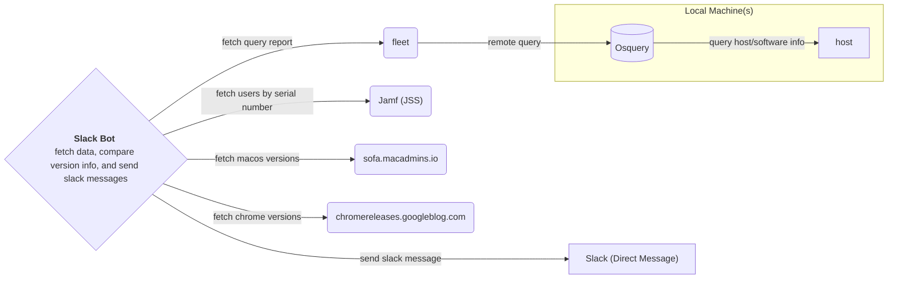

# RFC Software Update Reminder SlackBot

A slackbot to help remind folks when their computers (and/or software like Chrome) is out of date.

The goal is to decrease the time it takes folks to acknowledge and install software updates by increasing the visibility of updates through a slackbot that sends direct messages ideally in a digest format. Results can be measured by the average time-to-install (TTI) when a new update is released.

Although this RFC focuses on macOS updates the benefit to this system is that it can easily be extended to include other platforms including Windows, Linux, and ChromeOS. Additionally in the future you can feed all this data into a log aggregator (GrayLog, ElasticSearch, Loki) for enhanced reporting.


## Assumptions

- Users (and emails) are assigned to computers in Jamf Pro
- IT can spin up architecture in AWS or GCP


## High-Level Requirements

- High-quality reporting of data from users’ machines, achieved using Osquery and fleet.
- Feeds of version info, machine readable information about software updates, namely sofa.macadmins.io and chromereleases.googleblog.com.
- The Bot itself is ideally a stateless python script that runs on a AWS Lambda or on GCP Cloud Functions.


## Architectural Overview



## Feeds

We can get these from a variety of places, some examples are:

- macOS: https://sofa.macadmins.io 
- Chrome: https://chromereleases.googleblog.com/feeds/posts/default


## Reporting

We can use Osquery to report the hosts system version, this tool is both open-source and has a large community so it is well documented.

See https://osquery.io 


#### Deploy Osquery via Jamf Pro to macOS machines

In production we would deploy this with a Jamf policy, using the PKG from https://osquery.io/downloads/official/5.12.1 

We could keep this updated using AutoPKG (https://github.com/autopkg/autopkg) (as we would for most standard applications). This is deserving of its own RFC :)


#### Test Osquery locally on macOS

You can test an example query on macOS by installing osquery locally:

`brew install --cask osquery` 

In terminal run: 

`osqueryi`

Paste the following query in the interactive shell:

```sql
SELECT 
    (SELECT hardware_serial FROM system_info) AS hardware_serial,
    (SELECT version from os_version) AS os_version,
    (SELECT bundle_short_version FROM apps WHERE bundle_identifier LIKE 'com.google.Chrome') AS chrome_version;
```

You should see a result similar to the following:

```
+-----------------+------------+----------------+
| hardware_serial | os_version | chrome_version |
+-----------------+------------+----------------+
| FCXXXXXXXX      | 14.5       | 126.0.6478.116 |
+-----------------+------------+----------------+
```


## fleet

This component offers centralized reporting by running remote queries on hosts with Osquery installed.

This is probably the most complex component and would most likely need to be broken out into its own epic, however there is great documentation on how to spin this up in AWS using Terraform (https://fleetdm.com/docs/deploy/deploy-fleet#aws) and if that feels like too much work to maintain in the long run they offer a hosted version (https://fleetdm.com/pricing). 

Ideally we would use Gitops to maintain the deployment using a CI/CD tool like github actions to keep the deployment up to date, this would be especially easy as they provide the Terraform code in the docs.


## The SlackBot

A stateless python script so we don’t need to maintain a database, this should be able to run on a schedule. Ideally once-a-week or possibly every couple of days. Daily is likely too often and could cause notification fatigue. The bot uses the Slack Bolt SDK library and the requests package.


```python
import requests
from slack_bolt import App

SLACK_BOT_TOKEN = "slack_token_here"

FLEET_API_URL = "https://fleet.it.example.com/api/v1/fleet"
FLEET_API_KEY = "fleet_api_key"
FLEET_QUERY_ID = "123"
FLEET_QUERY_REPORT_URL = f"{FLEET_API_URL}/queries/{FLEET_QUERY_ID}/report"

JAMF_URL = "https://example.jamfcloud.com"
JAMF_API_USER = "test@example.com"  # This should not be hardcoded :)
JAMF_API_PASS = "hunter2"  # We can load secrets using env variables
JAMF_API_TOKEN_URL = f"{JAMF_URL}/api/v1/auth/token"
JAMF_API_COMPUTERS_URL = f"{JAMF_URL}/JSSResource/computers/serialnumber"

SOFA_JSON_URL = "https://sofa.macadmins.io/v1/macos_data_feed.json"

app = App(token=SLACK_BOT_TOKEN)


def fetch_jamf_token():
    response = requests.post(JAMF_API_TOKEN_URL, auth=(JAMF_API_USER, JAMF_API_PASS))
    response.raise_for_status()
    return response.json()["token"]


def fetch_fleet_query_report():
    headers = {"Authorization": f"Bearer {FLEET_API_KEY}"}
    response = requests.get(FLEET_API_URL, headers=headers)
    response.raise_for_status()
    return response.json()


def fetch_latest_macos_versions():
    response = requests.get(SOFA_JSON_URL)
    response.raise_for_status()
    data = response.json()
    latest_versions = [os_version["Latest"]["ProductVersion"] for os_version in data["OSVersions"]]
    return latest_versions


def fetch_jamf_user_by_serial(hardware_serial):
    jamf_token = fetch_jamf_token()
    headers = {
        "Authorization": f"Bearer {jamf_token}",
        "Accept": "application/json"
    }
    response = requests.get(f"{JAMF_API_COMPUTERS_URL}/{hardware_serial}", headers=headers)
    response.raise_for_status()
    data = response.json()
    user_email = data["computer"]["location"]["email_address"]
    return user_email


def send_slack_message(user_id, message):
    app.client.chat_postMessage(channel=user_id, text=message)


def main(event, context):
    fleet_report = fetch_fleet_query_report()
    latest_macos_versions = fetch_latest_macos_versions()

    for host in fleet_report["results"]:
        host_os_version = host["os_version"]
        hardware_serial = host["hardware_serial"]

        if host_os_version not in latest_macos_versions:
            user_email = fetch_jamf_user_by_serial(hardware_serial)
            message = f"Hey, it looks like your macOS version ({host_os_version}) is out of date. Please update it! - Duolingo IT"
            send_slack_message(user_email, message)
            print(f"Sent message to {user_email} about device with serial number {hardware_serial}")


if __name__ == "__main__":
    main({}, {})

```


## Packaging and Deployment

The bot itself can be deployed to AWS Lambda, using Cloud Watch to schedule triggers to run. Or on GCP this can run as a Cloud Function using Google Cloud Scheduler to achieve the same results. This could also be packaged in a Docker container and run in AWS ECS. 

Regardless of which cloud provider is used I would suggest using Terraform to spin up that infrastructure and deploy the bot as part of a CI/CD workflow. This can be achieved easily and quickly using GitHub Actions.


## Further Considerations

- The bot code should include error handling and support for rate limiting before running in prod.
- You can add support for virtually any application or even things like locally install python packages or chrome extensions, the sky's the limit.
- The bot is stateless, this makes it easy to run but it would make it tough or impossible to implement features like snoozing notifications or allowing the user to configure additional reminders.
